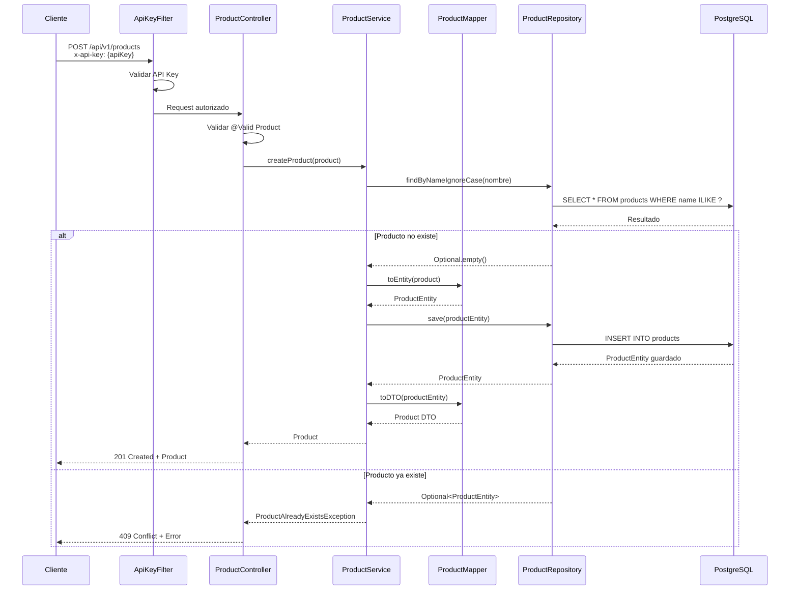
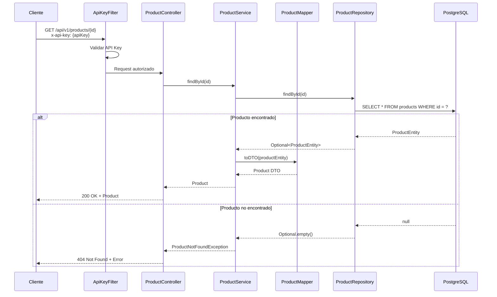
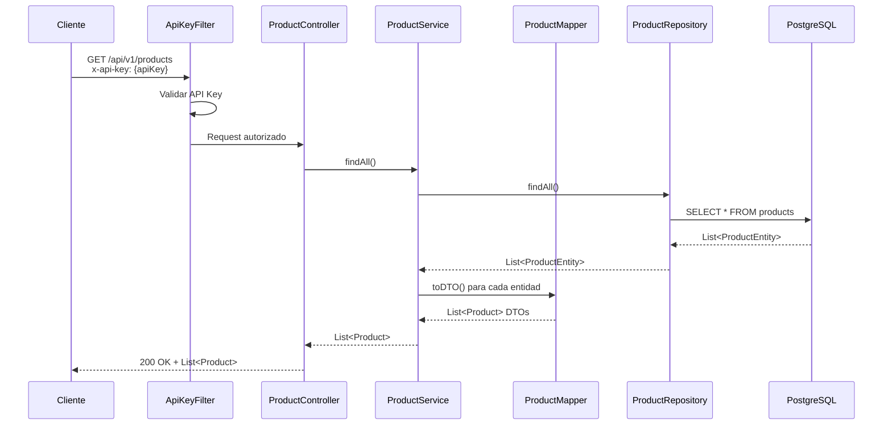

# Products Service

Microservicio REST para la gestión de productos desarrollado con Spring Boot 3.2.6.

## 🚀 Tecnologías

- **Java 17**
- **Spring Boot 3.2.6**
- **Spring Data JPA**
- **PostgreSQL**
- **Gradle**
- **MapStruct**
- **OpenAPI 3**
- **JaCoCo** (Cobertura de código)

## 📋 Prerrequisitos

- Java 17+
- Gradle 8.4+
- PostgreSQL

## ⚙️ Configuración

### Variables de Entorno

```bash
SPRING_DATASOURCE_URL=jdbc:postgresql://localhost:5432/microdb
SPRING_DATASOURCE_USERNAME=postgres
SPRING_DATASOURCE_PASSWORD=postgres
PRODUCTS_API_KEY=your-api-key
```

### Base de Datos

El servicio utiliza PostgreSQL con configuración automática de esquemas (`hibernate.ddl-auto=update`).

## 🏃‍♂️ Ejecución

### Desarrollo Local

```bash
./gradlew bootRun
```

### Construcción

```bash
./gradlew build
```

### Docker

```bash
docker build -t products-service .
docker run -p 8080:8080 products-service
```

## 📡 API Endpoints

| Método | Endpoint | Descripción |
|--------|----------|-------------|
| `POST` | `/api/v1/products` | Crear producto |
| `GET` | `/api/v1/products/{id}` | Obtener producto por ID |
| `GET` | `/api/v1/products` | Listar todos los productos |

### Modelo de Producto

```json
{
  "id": 1,
  "nombre": "Producto Ejemplo",
  "precio": 99.99,
  "descripcion": "Descripción del producto"
}
```

## 🔐 Autenticación

El servicio utiliza autenticación por API Key. Incluye el header `x-api-key` en todas las peticiones a endpoints `/api/*`.

## 📊 Diagramas de Secuencia

### Crear Producto



### Obtener Producto por ID



### Listar Todos los Productos



## 🔧 Características

- **Validación de datos** con Bean Validation
- **Mapeo de entidades** con MapStruct
- **Documentación API** con OpenAPI 3
- **Monitoreo** con Spring Actuator
- **Seguridad** con API Key Filter
- **Cobertura de pruebas** mínima del 80%

## 🧪 Testing

```bash
./gradlew test
./gradlew jacocoTestReport
```

## 📊 Monitoreo

- **Health Check**: `/actuator/health`
- **Info**: `/actuator/info`
- **API Docs**: `/swagger-ui.html`

## 📁 Estructura del Proyecto

```
src/main/java/co/com/linktic/products/
├── config/          # Configuraciones
├── controller/      # Controladores REST
├── entity/          # Entidades JPA
├── exception/       # Manejo de excepciones
├── mapper/          # Mappers MapStruct
├── model/           # DTOs
├── repository/      # Repositorios
└── service/         # Lógica de negocio
```